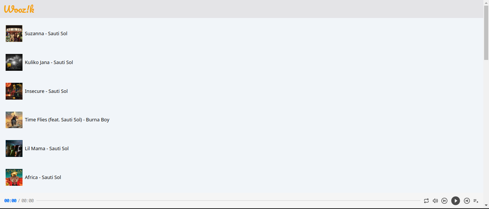

# Wooz!k

## Table of Content

- [Description](#description)
- [Screenshot](#screenshot)
- [Installation](#install-requirements)
- [Technology Used](#technology)
- [License](#license)
- [Authors Info](#authors-Info)

## Description

Wooz!k is a web-based platform that enables users to preview songs using the Deezer API from Rapid API. This application has been designed to provide users with a seamless experience. It is a tool for music lovers and industry professionals alike, enabling them to explore and discover new music in a highly efficient and streamlined manner.

## Screenshot

# 

## Install Requirements

- Computer

- Internet Access

- Git

- Terminal

- Npm

## Installation

On your computer open terminal and run:

    $ git clone https://github.com/qurriahSam/woozer.git

    $ cd woozer

    $ npm install

    $ npm start

[Go Back to the top](#Wooz!ki)

## Technology

- Tailwind CSS - Has been used for styling the navbar and other elements on the landingpage.

- ReactJS - Has been used to create components of the web app.

- Deezer Api from Rapid Api - used to fetch songs.

## Links

- Live Site URL: [Wooz!k](https://woozer.vercel.app/)

[Go Back to the top](#Wooz!k)

## License

[MIT](./LICENSE) License.

[Go Back to the top](#Wooz!k)

## Authors Info

Linked - [Sam Kuria](https://www.linkedin.com/in/sam-kuria-0904b01a1)

[Go Back to the top](#Wooz!k)
